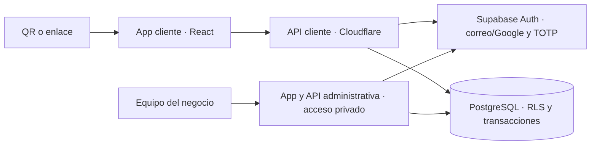

# PIT DETAIL Club

Aplicación de fidelización para detailing, mecánica básica y cambio de aceite en Venezuela. Conserva el diseño de la beta, con tarjeta de puntos, promociones, rappel y vehículos del cliente: autos, motos y embarcaciones.

La versión conectada usa **React + TypeScript + Vite**, una API **Hono en Cloudflare Workers** y **PostgreSQL + Supabase Auth**. El [piloto cliente](https://club.pit-detail.workers.dev) permite acceso con Google y registro por correo con contraseña y confirmación, en los planes gratuitos. El piloto usa Gmail SMTP para las verificaciones; su capacidad de envío es limitada.

| Componente                   | Ubicación                          | Responsabilidad                                                                         |
| ---------------------------- | ---------------------------------- | --------------------------------------------------------------------------------------- |
| App cliente                  | `cloud/client/`                    | Registro, acceso, tarjeta, vehículos, puntos, beneficios y perfil.                      |
| Administración independiente | `cloud/admin/`                     | Servicios, anulaciones, canjes, reglas y auditoría. Sin publicación pública automática. |
| API                          | `cloud/worker/`                    | Cookies HttpOnly, validación, permisos y comunicación con Supabase.                     |
| Base de datos                | `supabase/migrations/`             | Transacciones, permisos por fila, puntos, historial y roles.                            |
| Pruebas                      | `cloud/tests/`, `tests/cloud-e2e/` | Vitest, PostgreSQL, Playwright Chromium/WebKit y recuperación de copias.                |



Cada cuenta nueva recibe **2.000 puntos de bienvenida una sola vez**. La base registra el movimiento y su auditoría en la misma transacción que crea el perfil; volver a iniciar sesión no genera más puntos. Se aplica desde la migración de bienvenida y no añade créditos retroactivos a cuentas existentes. El regalo aparece en el historial, no es un servicio y no cuenta para el gasto trimestral del rappel.

Los servicios registrados por administración generan **$1 = 1.000 puntos**, con importes de $5 a $250. El saldo no se importa de la demo ni se acepta desde el navegador. Cada servicio tiene una referencia para evitar duplicados; las anulaciones compensan el movimiento original y quedan auditadas. Si sus puntos ya se gastaron, la anulación se rechaza para no crear saldo negativo.

Los códigos de canje caducan a los cinco minutos; el descuento de puntos ocurre al confirmarlos el administrador. El rappel usa el trimestre de Caracas y se valida nuevamente al canjear. Varios vehículos pueden pertenecer a una cuenta; todavía no hay saldos compartidos entre cuentas de una flota.

El segundo factor TOTP es obligatorio para administradores y opcional para clientes. Una vez activado, la API y la base exigen completarlo. Las contraseñas y factores los gestiona Supabase; la app no guarda tokens de acceso en `localStorage`. Los roles se mantienen en un esquema privado y no se pueden elegir al registrarse. El Worker utiliza la clave pública y la sesión del usuario, nunca `service_role`.

## Ejecutar y verificar

Node 24 LTS, npm y, para las pruebas completas, Docker y herramientas PostgreSQL 17.

```sh
npm ci
npm run verify:cloud
npx playwright install chromium webkit
npx supabase start -x realtime,storage-api,imgproxy,postgres-meta,studio,edge-runtime,logflare,vector,supavisor
node scripts/prepare-cloud-tests.mjs
npm run test:cloud:e2e
```

La preparación crea únicamente cuentas ficticias en Supabase local y archivos privados ignorados por Git. Rechaza proyectos remotos y no sobrescribe variables locales existentes. Playwright arranca ambos portales en `127.0.0.1:8787` y `127.0.0.1:8788` y verifica el registro mediante la bandeja de correo local, MFA y operaciones entre portales.

`npm run dev:cloud` sirve la compilación cliente; `npm run dev:cloud:admin` sirve la administrativa. Después de modificar React, reconstruir con `build:cloud` o `build:cloud:admin`.

El workflow `cloud-checks.yml` ejecuta pruebas unitarias, integración PostgreSQL, recorridos reales de navegador y una copia cifrada seguida de restauración sobre una base vacía. Solo publica capturas de la interfaz con datos de prueba; nunca trazas con factores de acceso.

## Publicar el piloto

Crear las ramas `feat/*` y `fix/*` desde `develop`. Integrarlas mediante PR después de pasar las pruebas; promover una revisión probada a `main` para publicarla. El workflow de producción solo permite desplegar desde `main`. Mientras no se configure su token Cloudflare en GitHub, el despliegue se realiza desde el equipo autorizado, con `main` limpio y actualizado.

Seguir [la guía de despliegue gratuito y operación](docs/cloud-deployment.md). El workflow manual `cloud-deploy.yml` vuelve a ejecutar las pruebas, aplica migraciones, comprueba la configuración de acceso y publica exclusivamente el portal cliente. Genera un PNG con el QR y un archivo con el enlace.

La [beta de GitHub Pages](https://moriarty369.github.io/pit-detail-club/) sigue siendo una demostración con datos en el navegador. El enlace y QR existentes se cambiarán únicamente después de comprobar el acceso al nuevo despliegue. Los comandos `build`, `test` y `test:server` mantienen las versiones anteriores; los comandos de la versión nueva llevan `cloud`.

La implementación anterior de Node/SQLite se conserva documentada en [la guía del prototipo local](docs/legacy-sqlite.md). No debe confundirse con el backend Supabase del nuevo MVP.
